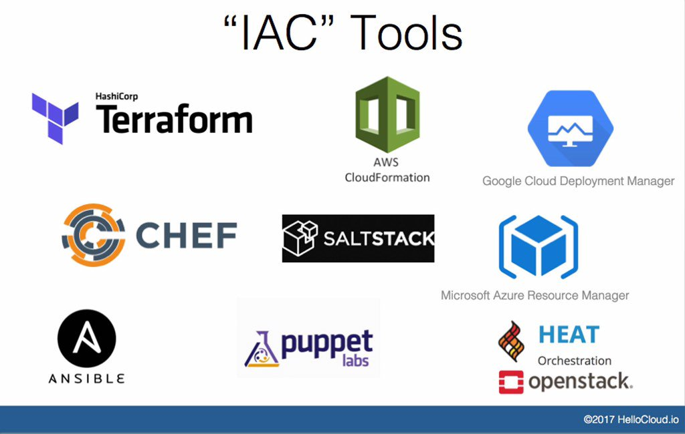

# What is Infrastructure-As-Code?

For years IT teams managed their data center infrastructure using a purely manual approach by physically setting up servers, installing and configuring the operating system. This process also included manually connecting the networks, middleware, and storage applicances. 

Managing all this infrastructure is a tedious full time job but this was improved with the adoption of technologies like virtualization. Virtualization enabled developers to provision their own infrastructure liike containers and virtual machines when ever they needed.

With the emergance of public cloud providers like Google Cloud, Amazon AWS, and Micorsoft Auzure managing critical infrastructure has been revolutionized. Along with cloud technologies and the adoption of the devops approach to software development, IT teams started making their job a bit  easier by leverage automation through scripts would provision, configure and manage the infrastructure.

This new process evolved into what we all know today as _Infrastructure-as-Code_ or _IaC_, which is the automation of infrastructure provisioning and management using software development principles and practices. You manage your infrastructure through a high-level descriptive model and using the same version control methods as traditional software development code. 

The idea behind _IaC_ is to treat your infrastructure like software. Write code, test it, and execute it to provision, update, and delete the required infrastructure. This code, like traditional software code, can be changed, updated, and deployed through a _continous integration / continuous delivery_ (CI/CD) procress.

## IaC Tooling



This statement may stir some arguments within the community but in my opion there are two categories of tooling for infrastructure _Configuration-As-Code_ (CaC) and _Infrastructure-As-Code_ (IaC). 

_CaC_ tools are used to configure the software and systems on the infrastructure where as _IaC_ tools orchestrates the provisioning/creation of the infrastructure. 

Some may interchangeably use _CaC_ tools, like [Ansible](https://www.ansible.com/) and [Chef](https://www.chef.io/), to provision their infrastructure but they are not really meant for infrastructure orchestration. These tools are meant to work together, _IaC_ tools for provisioning your infrastructure and _CaC_ tools for configuring and managing you infrastructure.

In this post I will be focusing on _IaC_ or infrastructure orchestration tools and provide my opinion and recommendations on each. The tools I will be covering are:

* [Terraform](www.terraform.io)
* [Terraform CDK](https://github.com/hashicorp/terraform-cdk)
* [Azure Resource Manager (ARM)](https://docs.microsoft.com/en-us/azure/azure-resource-manager/management/overview)
* [CloudFormation](https://aws.amazon.com/cloudformation/)
* [Cloud Deployment Manager](https://cloud.google.com/deployment-manager)
* [Pulumi](https://www.pulumi.com/)
* [Azure Bicep](https://devblogs.microsoft.com/devops/project-bicep-next-generation-arm-templates/)

### Terraform 

Lets start with the most popular and probably most used tool, _Hashicorp's Terraform_. _Terraform_ is an open source infrastructure-as-code software that prides itself on being platform agnostic. This means you can use this tool to provision infrastructure in any public cloud as well as on-premise. 

This platform independance is accomplished by the codification of each of the cloud providers APIs into what _Hashicorp_ calls [terraform providers](https://registry.terraform.io/browse/providers).

Within the _terraform_ template file you specify the _provider block_, as shown in the snippet below, this will indicate to the _terraform cli_ to use the apis for the specified provider.

```
# Specify the terraform provider
provider "google" {
    project = var.project_id
    region = var.region
    credentials = file("credentials.json")
}

```

The following snippet will provision a webserver in Google Cloud.

```
# Create the GCP Compute Engine Instance that will be our webserver
resource "google_compute_instance" "web-vm" {
    name = var.webservername
    machine_type = var.machine_type
    zone = var.zone
    tags = ["http-server"]
    labels = {
        "environment" = "test"
        "team"        = "devops"
        "application" = "webserver"
    }

    boot_disk {
        initialize_params {
            image = data.google_compute_image.debian.self_link
        }
    }

    # every project comes standard with a "default" network...recommended to remove in a prodcution environment and create a secure one.
    network_interface {
        network = "default"
        access_config {
            // Ephemeral IP
        }
    }

    metadata_startup_script = data.template_file.nginx.rendered
}
```


