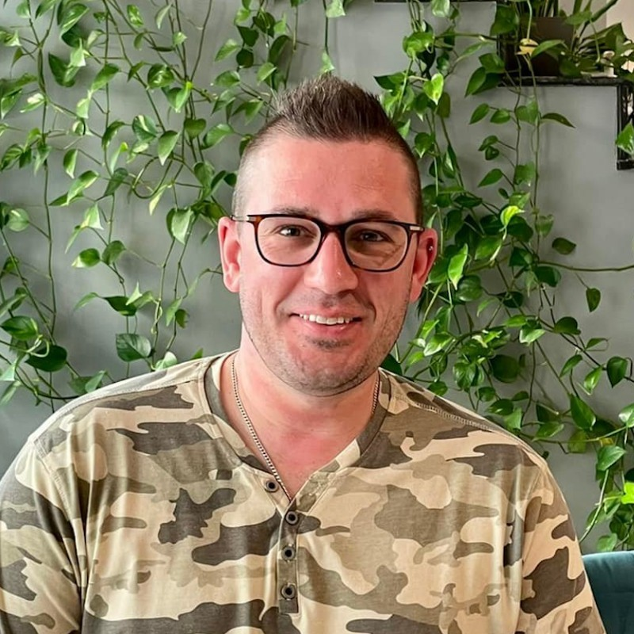
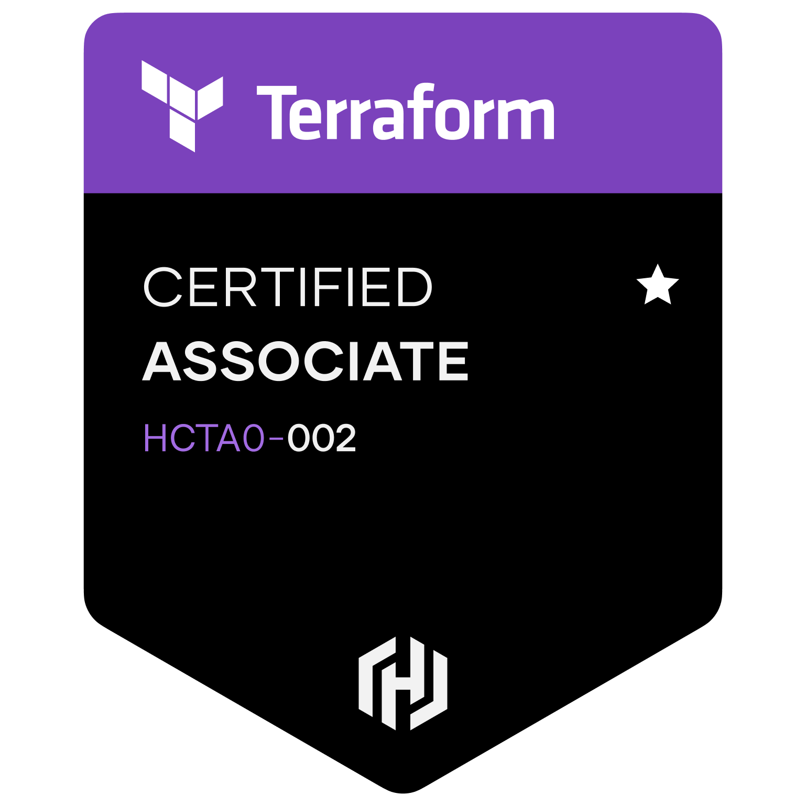

# About Me

 Hey there!

Welcome to my ramblings, but first a little bit about myself.

My name is David Tessier, I am a strategically focused, Cloud Architect specializing in application and infrastructure modernization, as well as focusing on networking and security. Currently I work at [SADA Systems](https://www.sada.com), Google Cloud Partner of the year 5 years in a row, where I am a Senior Pre-sales Cloud Solutions Architect. I hold various cloud and industry standard certifications which enables me to build innovative solutioning by leveraging strong technological expertise. I hold several certifications which are listed below.

 

|             |          |       |       | 
| ----------- | -------- | ----- | ----- |
| {:target="_blank"}      | {:target="_blank"} | {:target="_Blank"} | [{width=200em}](https://www.credly.com/badges/8b8a37e7-5934-4bd0-a0fa-31172bc5e96a/public_url){:target="_Blank"} | 
| [{width=200em, color=white}](https://www.credly.com/badges/736ec0c7-25a1-4ed4-b7a5-2c6847c4997e/public_url){:target="_Blank"} |

 

 

